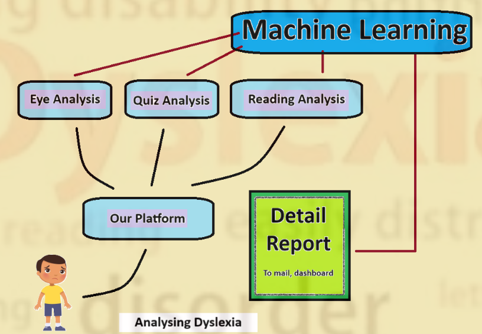

# 🚀 Enhanced Tools for Dyslexia and Learning Disabilities in Students

**Team Name:** _Innov8ors_  
**Hackathon:** _FantomCode2025_  
**Date:** _12/04/2025_

---

## 📖 Table of Contents

1. [Introduction](#introduction)
2. [Problem Statement](#problem-statement)
3. [Solution Overview](#solution-overview)
4. [Tech Stack](#tech-stack)
5. [Architecture / Diagram (if any)](#architecture--diagram-if-any)
6. [Installation & Usage](#installation--usage)
7. [Team Members](#team-members)

---

## 🧠 Introduction

([Dyslexia](https://www.mayoclinic.org/diseases-conditions/dyslexia/symptoms-causes/syc-20353552#:~:text=Dyslexia%20is%20a%20learning%20disorder,the%20brain%20that%20process%20language.)), a common learning difficulty affecting 15–20% of the global population, often goes undiagnosed until it significantly impacts academic and emotional development. Many students face delayed diagnosis due to the lack of accessible tools, leading to missed opportunities for timely intervention.

Our project presents an advanced educational tool that leverages eye-tracking and audio analysis to detect and support students with dyslexia and other learning disabilities. It builds a complete ecosystem connecting students, teachers, and support professionals to ensure early identification and intervention.

---

## ❗ Problem Statement

- **Prevalence:** ([1 in 5 students](https://www.dyslexia1n5.com/)) are affected by dyslexia, often resulting in lower academic performance and reduced self-esteem.
- **Detection Gap:** Traditional methods miss up to **50%** of dyslexic students ([NIH](https://www.ncbi.nlm.nih.gov/books/NBK557668/)), delaying necessary support.
- **Delayed Intervention:** Without early detection, dropout rates increase drastically. With intervention, dropout rates can be reduced by **70%** and lifetime earnings boosted by **20%** ([Yale Center for Dyslexia & Creativity](https://dyslexia.yale.edu/)).
- **Lack of Tools:** Current systems lack personalization, early screening access, and real-time progress tracking.

---

## ✅ Solution Overview

We propose a unified platform that:

1. 🧾 **Parent-Friendly Assessment**  
   A smart, form-based system where parents can answer structured questions to auto-generate an initial risk report.

2. 🔍 **AI-Powered Detection Engine**  
   Uses a combination of **eye-tracking**, **audio pattern analysis** (`Librosa`), and **facial expression detection** to assess dyslexia likelihood, delivering detailed visual reports.

3. 🧠 **Cognitive Skill-Building Quizzes**  
   Dynamically generated quizzes aligned with a student’s performance metrics to boost memory, focus, and comprehension.

4. 🎮 **Gamified Learning Modules**  
   Engaging and accessible games designed to strengthen phonological awareness and reading fluency.

5. 🤖 **AI Chatbot for Learning Assistance**  
   An intelligent chatbot to guide students through lessons, answer questions, and recommend activities based on weaknesses detected.

**What makes us unique:**

- **Multimodal Analysis:** Unlike traditional screeners, we analyze **visual**, **auditory**, and **emotional** cues in real time.
- **End-to-End Support:** From early screening to personalized remediation, everything is integrated into one ecosystem.
- **Inclusive & Accessible:** Designed for both parents and educators — no technical expertise required.
- **Research-Backed Accuracy:** Eye-tracking models reach up to **85% detection accuracy**, surpassing traditional methods ([Source](https://www.ncbi.nlm.nih.gov/pmc/articles/PMC7177981/)).
- **Continuous Learning Loop:** The platform evolves with the user through performance feedback and AI recommendations.

---

## 🛠️ Tech Stack

- **Frontend:** ReactJS, TypeScript, TailwindCSS
- **Backend:** FastAPI (Python)
- **Database:** MongoDB
- **Core Logic & ML:** OpenCV, Mediapipe
- **Tools:** GitHub, VSCode

---

## 🧩 Architecture / Diagram (if any)




> 📌 This includes Eye Tracking Module, Audio Analysis Engine, ML-Based Analyzer, Report Generator, and Web/App Interfaces.

---

## 🧪 Installation & Usage

### Prerequisites

- Docker
- Python (FastAPI)
- TypeScript
- MongoDB
- OpenCV
- Mediapipe
- Libraries from `requirements.txt` and `package.json`

### Steps

```bash
## Clone the repository
git clone https://github.com/FantomCode25/Innov8ors.git

# Backend Setup
cd Innov8ors
cd backend

## Build and run with Docker

docker build -t backend-api .
docker run -p 8000:8000 backend-api

pip install -r requirements.txt
python app.py

## To run without Docker:

## Create virtual environment
python -m venv venv
source venv\Scripts\activate

## Install dependencies
pip install -r requirements.txt

## Run the application
uvicorn main:app --reload


# Frontend Setup (Web)
cd Innov8ors
cd frontend

# Install dependencies
npm install

# Start the development server
npm run dev
```

We have well maintained proper backend documentation 
After cloning Access the API at `http://localhost:8000/docs`
Our Hosted API DOCS: `https://dylexiaai.onrender.com/docs` and `https://dylexiaai.onrender.com/redoc` 

Our Hosted Project: `https://dylexia.vercel.app/`

## Team Members

- Aaradhya Saikia
- Amit Kumar Singh
- Ved Prakash Singh
- Adwait Aayush

> 💡 Each member contributed to ideation, testing, and final presentation.


